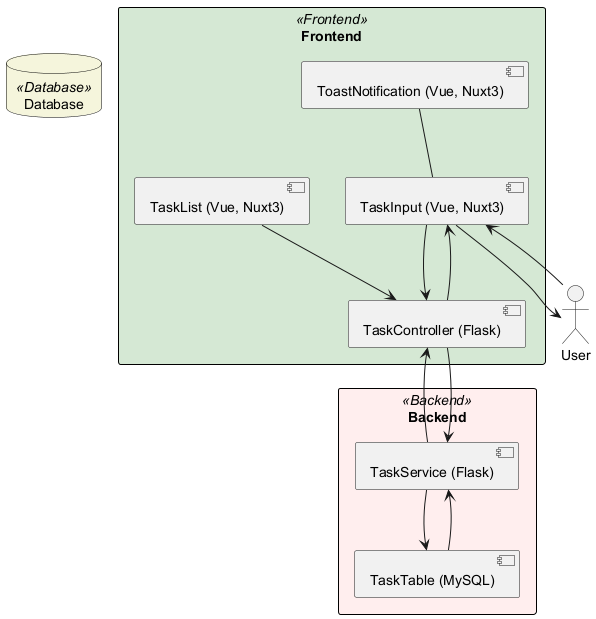
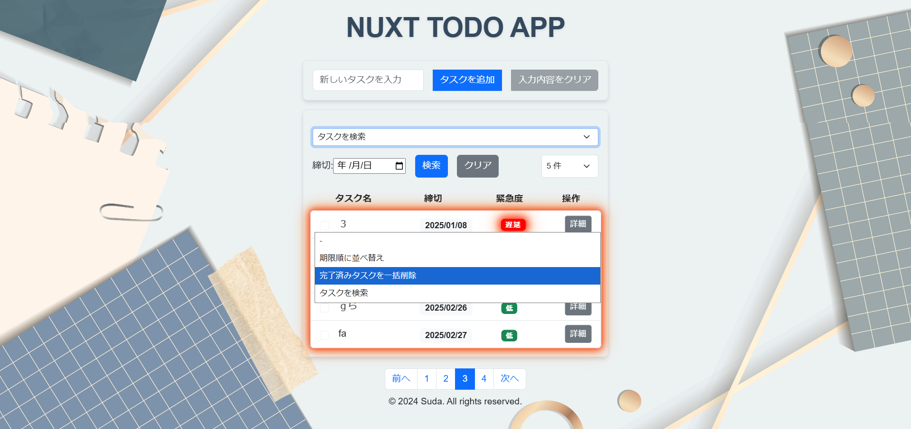

# 使用技術の詳細

## 1. 概要

### 1.1 イントロダクション

このドキュメントは、Nuxt.js を使用したタスク管理アプリケーションの設計書です。アプリケーションの構成、使用技術、動作フローについて詳細に説明します。

### 1.2 目的

このドキュメントの目的は、プロジェクトの開発者がアプリケーションの設計と実装について統一された理解を持つことを助けることです。

### 1.3 範囲

この設計書は、フロントエンドおよびバックエンドの主要なコンポーネント、データモデル、使用技術、開発およびテストの設定を網羅します。

### 1.4 定義

このセクションでは、このドキュメントで使用される主要な用語と概念を簡潔に記述します。

- **タスク管理**: タスクの作成、編集、削除、完了などの操作を指します。
- **フロントエンド**: ユーザーが直接操作する部分。Vue.js と Nuxt.js を使用。
- **バックエンド**: サーバーサイドのロジックとデータ管理を担当する部分。Flask と MySQL を使用。

## 2. アーキテクチャ

### 2.1 アーキテクチャ図

アプリケーションの全体アーキテクチャ図を提供し、各コンポーネントの関係を示します。

### 2.2 コンポーネント説明

各コンポーネントの詳細な説明を提供します。

## 3. 状態遷移図と状態説明

### 3.1 状態遷移図

ユーザーの操作に応じた状態遷移図を提供します。

### 3.2 状態説明

各状態の詳細な説明を提供します。

状態遷移図に基づいて、各状態の詳細を以下に説明します：

1. **初期状態**: アプリケーションが初期化された状態。
2. **ログイン状態**: ユーザーがログインしている状態。
3. **タスク表示状態**: ユーザーがタスクを表示している状態。
4. **タスク編集状態**: ユーザーがタスクを編集している状態。
5. **タスク完了状態**: ユーザーがタスクを完了させた状態。
6. **ログアウト状態**: ユーザーがログアウトしている状態。

## 4. フローチャート

### 4.1 全体のフローチャート

アプリケーション全体のフローチャートを提供し、主要な操作フローを示します。

### 4.2 フロントエンドフローチャート

フロントエンドの具体的な操作フローを示すフローチャートです。

### 4.3 詳細なプロセス説明

このセクションでは、各プロセスのステップバイステップの詳細な説明を提供します。

#### 4.3.1 タスクの作成

1. **タスクの作成ボタンをクリック**:

   - ユーザーはタスク一覧画面で「新しいタスクを作成」ボタンをクリックします。

2. **タスク作成フォームの表示**:

   - 新しいタスク作成フォームが表示されます。ユーザーはタスク名、説明、期限などの情報を入力します。

3. **タスクの保存**:

   - フォームの「保存」ボタンをクリックすると、入力された情報がサーバーに送信され、新しいタスクがデータベースに保存されます。

4. **タスク一覧へのリダイレクト**:

   - タスクの保存が成功すると、ユーザーはタスク一覧画面にリダイレクトされ、新しいタスクが一覧に表示されます。

#### 4.3.2 タスクの編集

1. **タスクの選択**:

   - ユーザーは編集したいタスクをタスク一覧から選択します。

2. **タスク編集フォームの表示**:

   - 選択したタスクの編集フォームが表示され、ユーザーはタスク名、説明、期限などの情報を編集します。

3. **編集内容の保存**:

   - フォームの「保存」ボタンをクリックすると、編集された情報がサーバーに送信され、タスクが更新されます。

4. **タスク一覧へのリダイレクト**:

   - タスクの編集が成功すると、ユーザーはタスク一覧画面にリダイレクトされ、更新されたタスクが一覧に表示されます。

#### 4.3.3 タスクの削除

1. **タスクの選択**:

   - ユーザーは削除したいタスクをタスク一覧から選択します。

2. **削除確認ダイアログの表示**:

   - タスク削除確認ダイアログが表示され、ユーザーは削除の意図を確認します。

3. **タスクの削除**:

   - ユーザーが「削除」ボタンをクリックすると、タスクがサーバーから削除され、データベースからも削除されます。

4. **タスク一覧の更新**:

   - タスクの削除が成功すると、タスク一覧が更新され、削除されたタスクが一覧から消えます。

これにより、各プロセスがどのように動作するかを詳細に説明することができます。さらに詳細なプロセス説明や図を追加する場合は、各プロセスに対応する図をリンクします。

## 5. データモデル

### 5.1 データベース構造

データベースの構造を説明します。このアプリケーションのデータベースは以下のように定義されています：

このデータベース構造により、タスク管理アプリケーションで使用されるタスクデータが格納されます。各タスクには以下の項目が含まれます：

- `id`: 一意の識別子（自動増分、主キー）
- `text`: タスクの内容
- `completed`: タスクの完了状態（デフォルトは FALSE）
- `dueDate`: タスクの期限日

### 5.2 ER 図

エンティティとリレーションの図を示します。

## 6. サンプルコード

### 6.1 フロントエンドコード

フロントエンドの主要なコード例を提供します。

### 6.1.1 フロントエンドデザイン

このセクションでは、フロントエンドのデザイン例を示します。これらのデザインは、開発者が実際のフロントエンドを実装する際の参考として使用してください。

#### タスク詳細画面

#### タスク編集画面

#### タスクフィルター画面

#### タスク一覧画面

### 6.2 バックエンドコード

サーバサイドのサンプルコードを提供します。

## 7. 使用技術の詳細

### 7.1 フロントエンド技術

1. **Vue.js**

   - **説明**: Vue.js は、インタラクティブなユーザーインターフェースを構築するための JavaScript フレームワークです。
   - **特徴**: コンポーネントベースのアーキテクチャ、双方向データバインディング、仮想 DOM など。
   - **バージョン**: `latest`

2. **Nuxt3**

   - **説明**: Nuxt.js は、Vue.js の拡張フレームワークで、サーバーサイドレンダリング（SSR）や静的サイト生成（SSG）をサポートします。
   - **特徴**: ルーティングやデータフェッチの簡略化、豊富なモジュールエコシステム。
   - **バージョン**: `^3.15.1`

3. **Vue Toastification**

   - **説明**: ユーザーに非侵入的なトースト通知を提供するライブラリです。
   - **特徴**: カスタマイズ可能なトースト通知、柔軟な設定オプション。
   - **バージョン**: `^2.0.0-rc.5`

### 7.2 バックエンド技術

1. **Flask**

   - **説明**: Flask は、Python ベースのマイクロフレームワークで、シンプルかつ柔軟なウェブアプリケーションを構築するのに適しています。
   - **特徴**: 軽量、拡張可能、多くのプラグインとエクステンション。
   - **バージョン**: `1.1.2`

2. **MySQL**

   - **説明**: MySQL は、広く使用されているオープンソースのリレーショナルデータベース管理システムです。
   - **特徴**: 高パフォーマンス、スケーラビリティ、安全性。
   - **バージョン**: `8.0`

### 7.3 その他のユーティリティ

1. **Axios**

   - **説明**: HTTP クライアントライブラリで、API リクエストを簡単に行うために使用されます。
   - **バージョン**: `^1.7.9`

2. **Bootstrap**

   - **説明**: CSS フレームワークで、レスポンシブデザインとスタイリングを実現します。
   - **バージョン**: `^5.3.3`

### 7.4 テストツール

1. **Vitest**

   - **説明**: 高速なテストランナーで、ユニットテストと統合テストを実行するために使用されます。
   - **バージョン**: `^2.1.8`

2. **@nuxt/test-utils**

   - **説明**: Nuxt.js アプリケーションのテストを簡単に行うためのユーティリティ。
   - **バージョン**: `^3.15.1`

3. **TypeScript**

   - **説明**: 型安全な JavaScript で、コードの品質と保守性を向上させます。
   - **バージョン**: `^5.7.2`

## 8. 付録

### 8.1 用語集

このセクションでは、プロジェクトで使用される専門用語や略語の定義を記述します。

- **SSR (サーバーサイドレンダリング)**: サーバー側でコンテンツをレンダリングし、クライアントに送信する技術。
- **SSG (静的サイト生成)**: 事前に静的な HTML ページを生成し、サーバーに配置する技術。
- **CRUD**: Create, Read, Update, Delete の略で、データベース操作の基本的な操作を指す。
- **API (アプリケーションプログラミングインターフェイス)**: アプリケーション同士が通信するためのインターフェース。タスクデータの取得や更新に使用。
- **DOM**: Document Object Model の略で、HTML や XML 文書をプログラムから操作するための仕組み。

### 8.2 参考資料

プロジェクトの設計や実装に参考にした書籍、論文、ウェブサイトなどの資料を一覧化します。

- [Nuxt.js 公式ドキュメント](https://nuxt.com/docs)
- [Vue.js 公式ガイド](https://vuejs.org/guide/introduction.html)
- [Flask 公式ドキュメント](https://flask.palletsprojects.com/en/latest/)
- [MySQL 公式ドキュメント](https://dev.mysql.com/doc/)
