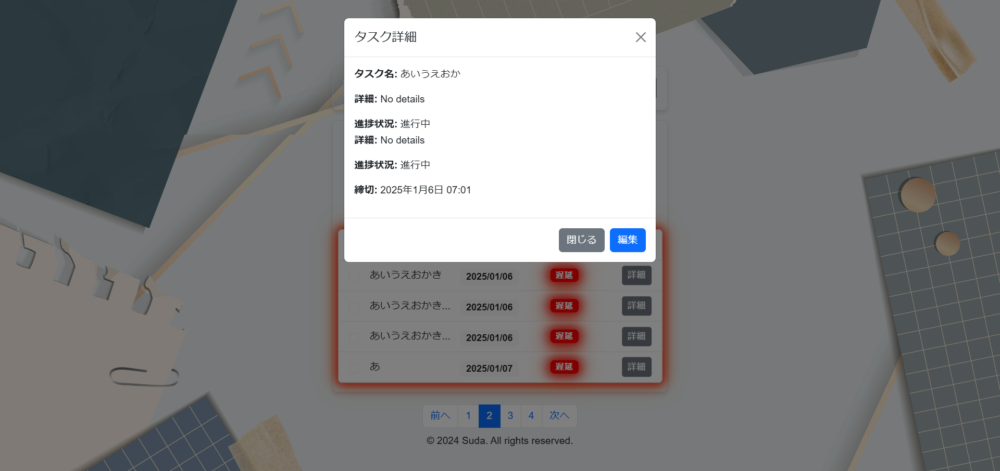

== 詳細設計 (Detailed Design)

=== 5. データモデル

==== 5.1 データベース構造

データベースの構造を説明します。このアプリケーションのデータベースは以下のように定義されています:

[source, database, subs="verbatim"]
----
include::../sample/backend/sql/initialize_db.sql[データベース初期化SQ]
----
このデータベース構造により、タスク管理アプリケーションで使用されるタスクデータが格納されます。各タスクには以下の項目が含まれます:

* id: 一意の識別子（自動増分、主キー）
* text: タスクの内容
* completed: タスクの完了状態（デフォルトは FALSE）
* dueDate: タスクの期限日

=== 5.2 ER 図

エンティティとリレーションの図を示します。

image::../images/TaskDatabaseERDiagram.png[ER図]

=== 6. サンプルコード

==== 6.1 フロントエンドコード

フロントエンドの主要なコード例を提供します。

===== 6.1.1 フロントエンドの初期化

Nuxt プロジェクトを初期化します。

[source, bash, subs="verbatim"]
----
npx nuxi init
----

===== 6.1.2 フロントエンドのコード例

[source, vue, subs="verbatim"]
----
include::../sample/frontend/src/components/TaskList.vue[タスク一覧コンポーネント]
----

===== 6.1.3 フロントエンドデザイン

このセクションでは、フロントエンドのデザイン例を示します。これらのデザインは、開発者が実際のフロントエンドを実装する際の参考として使用してください。

==== タスク詳細画面

==== タスク編集画面

image::../sample/frontend/images/task_edit.png[TaskEdit]

==== タスクフィルター画面

image::../sample/frontend/images/task_filter.png[TaskFilter]

==== タスク一覧画面

image::../sample/frontend/images/task_list.png[TaskList]

==== 6.2 バックエンドコード

サーバサイドのサンプルコードを提供します。

[source, python, subs="verbatim"]
----
include::../sample/backend/app.py[]
----

=== 7. 使用技術の詳細

==== 7.1 フロントエンド技術

1. **Vue.js**
   - **説明**: Vue.js は、インタラクティブなユーザーインターフェースを構築するための JavaScript フレームワークです。
   - **特徴**: コンポーネントベースのアーキテクチャ、双方向データバインディング、仮想 DOM など。
   - **バージョン**: `latest`

2. **Nuxt3**
   - **説明**: Nuxt.js は、Vue.js の拡張フレームワークで、サーバーサイドレンダリング（SSR）や静的サイト生成（SSG）をサポートします。
   - **特徴**: ルーティングやデータフェッチの簡略化、豊富なモジュールエコシステム。
   - **バージョン**: `^3.15.1`

3. **Vue Toastification**
   - **説明**: ユーザーに非侵入的な通知を提供するためのライブラリ。
   - **特徴**: シンプルでカスタマイズ可能なトースト通知。
   - **バージョン**: `^2.1.2`

==== 7.2 バックエンド技術

1. **Flask**
   - **説明**: Flask は、Python の軽量な Web フレームワークです。RESTful API を迅速に構築できます。
   - **特徴**: 軽量、柔軟、豊富な拡張機能を持つ。
   - **バージョン**: `^2.2.2`

2. **MySQL**
   - **説明**: MySQL は、リレーショナルデータベース管理システムです。
   - **特徴**: 高性能、大規模なデータを扱う能力、広範なサポート。
   - **バージョン**: `^8.0.26`

==== 7.3 その他のユーティリティ

1. **Axios**
   - **説明**: HTTP クライアントライブラリで、API リクエストを簡単に行うために使用されます。
   - **バージョン**: `^1.7.9`

2. **Bootstrap**
   - **説明**: CSS フレームワークで、レスポンシブデザインとスタイリングを実現します。
   - **バージョン**: `^5.3.3`

==== 7.4 テストツール

1. **Vitest**
   - **説明**: 高速なテストランナーで、ユニットテストと統合テストを実行するために使用されます。
   - **バージョン**: `^2.1.8`

2. **@nuxt/test-utils**
   - **説明**: Nuxt.js アプリケーションのテストを簡単に行うためのユーティリティ。
   - **バージョン**: `^3.15.1`

3. **TypeScript**
   - **説明**: 型安全な JavaScript で、コードの品質と保守性を向上させます。
   - **バージョン**: `^5.7.2`

==== 7.5 環境変数の設定

.env ファイルを作成し、以下の内容を記入します:

[source, env, subs="verbatim"]
----
MYSQL_HOST=localhost
MYSQL_USER=root
MYSQL_PASSWORD=root123!
MYSQL_DB=task_db
MYSQL_CURSORCLASS=DictCursor
----

==== 7.6 仮想環境の作成と依存関係の設定

依存関係を隔離することで競合を防ぐため、仮想環境を作成します。

[source, bash, subs="verbatim"]
----
python -m venv venv
----

作成した仮想環境を有効にするコマンド（Bash シェルの場合）:

[source, bash, subs="verbatim"]
----
source venv/Scripts/activate
----

`.gitignore`ファイルに以下の行を追加します:

[source, git, subs="verbatim"]
----
venv/
----

パッケージをインストールします:

[source, bash, subs="verbatim"]
----
pip install -r requirements.txt
----

requirements.txt の内容:

[source, text, subs="verbatim"]
----
blinker==1.9.0
click==8.1.8
colorama==0.4.6
Flask==3.1.0
Flask-Cors==5.0.0
Flask-MySQLdb==2.0.0
itsdangerous==2.2.0
Jinja2==3.1.5
MarkupSafe==3.0.2
mysqlclient==2.2.7
python-dotenv==1.0.1
Werkzeug==3.1.3
----

Nuxt.js を使用して開発サーバーを起動するには、以下のコマンドを実行します:

[source, bash, subs="verbatim"]
----
npm run dev
----

Flask アプリケーションを実行するには、以下のコマンドを実行します:

[source, bash, subs="verbatim"]
----
python app.py
----

=== 8. 付録

==== 8.1 用語集

このセクションでは、プロジェクトで使用される専門用語や略語の定義を記述します。

* SSR (サーバーサイドレンダリング): サーバー側でコンテンツをレンダリングし、クライアントに送信する技術。
* SSG (静的サイト生成): 事前に静的な HTML ページを生成し、サーバーに配置する技術。
* CRUD: Create, Read, Update, Delete の略で、データベース操作の基本的な操作を指す。
* API (アプリケーションプログラミングインターフェイス): アプリケーション同士が通信するためのインターフェース。タスクデータの取得や更新に使用。
* DOM: Document Object Model の略で、HTML や XML 文書をプログラムから操作するための仕組み。

==== 8.2 参考資料

プロジェクトの設計や実装に参考にした書籍、論文、ウェブサイトなどの資料を一覧化します。

* https://nuxt.com/docs[Nuxt.js 公式ドキュメント]
* https://vuejs.org/guide/introduction.html[Vue.js 公式ガイド]
* https://flask.palletsprojects.com/en/latest/[Flask 公式ドキュメント]
* https://dev.mysql.com/doc/[MySQL 公式ドキュメント]

=== 9. 結論

このドキュメントでは、タスク管理アプリケーションの設計、使用技術、動作フロー、テスト手法、デプロイメントの手順について詳細に説明しました。本アプリケーションは、ユーザーにとって直感的に使いやすいインターフェースと、効率的なタスク管理機能を提供します。今後の改善点としては、UI のさらなる改善や、新しい機能の追加が考えられます。
