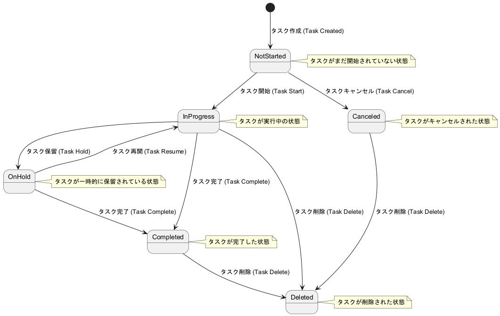
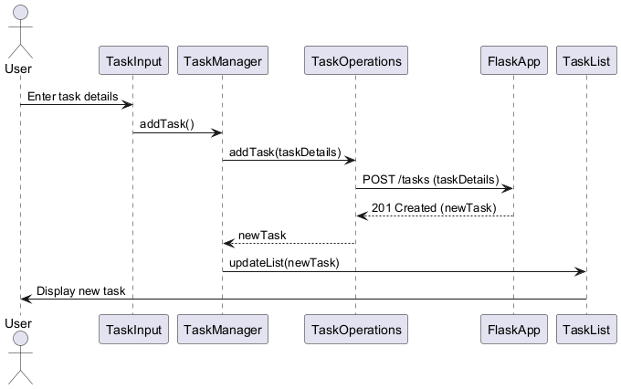
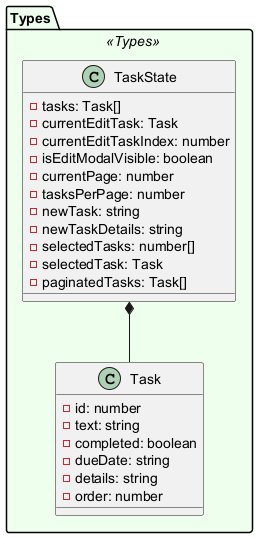
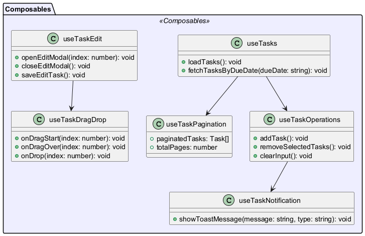
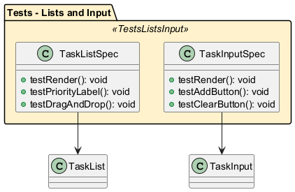

= 使用技術の詳細

== 要件定義 (Requirement Definition)

=== 1. 概要

==== 1.1 タスク一覧画面

image::../sample/frontend/images/task_list.png[alt=タスク一覧画面]

==== 1.2 イントロダクション

このドキュメントは、Nuxt.js を使用したタスク管理アプリケーションの設計書です。アプリケーションの構成、使用技術、動作フローについて詳細に説明します。

==== 1.3 目的

このドキュメントの目的は、プロジェクトの開発者がアプリケーションの設計と実装について統一された理解を持つことを助けることです。

==== 1.4 範囲

この設計書は、フロントエンドおよびバックエンドの主要なコンポーネント、データモデル、使用技術、開発およびテストの設定を網羅します。

==== 1.5 定義

このセクションでは、このドキュメントで使用される主要な用語と概念を簡潔に記述します。

* **タスク管理**: タスクの作成、編集、削除、完了などの操作を指します。
* **フロントエンド**: ユーザーが直接操作する部分。Vue.js と Nuxt.js を使用。
* **バックエンド**: サーバーサイドのロジックとデータ管理を担当する部分。Flask と MySQL を使用。

== 基本設計 (Basic Design)

=== 2. アーキテクチャ

==== 2.1 アーキテクチャ図

アーキテクチャ図はアプリケーション全体の構成を視覚的に示します。各コンポーネント間の関係とデータフローが明確にわかります。
以下にアプリケーションの全体アーキテクチャ図を提供し、各コンポーネントの関係を示します。

image::../images/TaskManagementArchitectureDiagram.png[アーキテクチャ図]

image::../images/SystemArchitectureDiagram.png[システムアーキテクチャ図]

==== 2.2 コンポーネント説明

各コンポーネントの詳細な説明を提供します。

image::../images/TaskComponentDiagram.png[コンポーネント図]

=== 3. 状態遷移図と状態説明

==== 3.1 状態遷移図

ユーザーの操作に応じた状態遷移図を提供します。

==== 3.2 状態説明

各状態の詳細な説明を提供します。

状態遷移図に基づいて、各状態の詳細を以下に説明します：

1. **初期状態**: アプリケーションが初期化された状態。
2. **ログイン状態**: ユーザーがログインしている状態。
3. **タスク表示状態**: ユーザーがタスクを表示している状態。
4. **タスク編集状態**: ユーザーがタスクを編集している状態。
5. **タスク完了状態**: ユーザーがタスクを完了させた状態。
6. **ログアウト状態**: ユーザーがログアウトしている状態。

=== 4. フローチャート

==== 4.1 全体のフローチャート

以下のフローチャートは、アプリケーション全体の主要な操作フローを示しています。ユーザーの操作に基づくシステムの挙動が一目でわかります。
これにより、設計書がさらにわかりやすくなり、他の開発者にも理解しやすくなります。

image::../images/TaskManagementFlowchart.png[タスク管理フローチャート]
image::../images/DetailedInteractionDiagram.png[詳細なインタラクション図]
image::../images/SimpleInteractionDiagram.png[シンプルなインタラクション図]
image::../images/TaskManagementDeploymentDiagram.png[タスク管理デプロイメント図]
image::../images/TaskManagementPackageDiagram.png[パッケージ図]
image::../images/TaskManagementUseCaseDiagram.png[ユースケース図]

==== 4.2 フロントエンドフローチャート

フロントエンドの具体的な操作フローを示すフローチャートです。

image::../images/FrontendTaskFlowchart.png[フロントエンドタスクフロー]

==== 4.3 バックエンドクラス図

バックエンドのクラス構造を示す図です。

image::../images/BackendClassDiagram.png[バックエンドクラス図]

image::../images/OverallSimplifiedDiagram.png[全体簡略図]

==== 4.4 テストクラス図

各テストのクラス図を示します。

image::../images/TestsUIComponents.png[テストUIコンポーネント]
image::../images/TestsLogic.png[テストロジック]

image::../images/TestsOverall.png[テスト全体]

==== 4.5 詳細なプロセス説明

このセクションでは、各プロセスのステップバイステップの詳細な説明を提供します。

===== 4.5.1 タスクの作成

1. **タスクの作成ボタンをクリック**:
   - ユーザーはタスク一覧画面で「新しいタスクを作成」ボタンをクリックします。

2. **タスク作成フォームの表示**:
   - 新しいタスク作成フォームが表示されます。ユーザーはタスク名、説明、期限などの情報を入力します。

3. **タスクの保存**:
   - フォームの「保存」ボタンをクリックすると、入力された情報がサーバーに送信され、新しいタスクがデータベースに保存されます。

4. **タスク一覧へのリダイレクト**:
   - タスクの保存が成功すると、ユーザーはタスク一覧画面にリダイレクトされ、新しいタスクが一覧に表示されます。

===== 4.5.2 タスクの編集

1. **タスクの選択**:
   - ユーザーは編集したいタスクをタスク一覧から選択します。

2. **タスク編集フォームの表示**:
   - 選択したタスクの編集フォームが表示され、ユーザーはタスク名、説明、期限などの情報を編集します。

3. **編集内容の保存**:
   - フォームの「保存」ボタンをクリックすると、編集された情報がサーバーに送信され、タスクが更新されます。

4. **タスク一覧へのリダイレクト**:
   - タスクの編集が成功すると、ユーザーはタスク一覧画面にリダイレクトされ、更新されたタスクが一覧に表示されます。

===== 4.5.3 タスクの削除

1. **タスクの選択**:
   - ユーザーは削除したいタスクをタスク一覧から選択します。

2. **削除確認ダイアログの表示**:
   - タスク削除確認ダイアログが表示され、ユーザーは削除の意図を確認します。

3. **タスクの削除**:
   - ユーザーが「削除」ボタンをクリックすると、タスクがサーバーから削除され、データベースからも削除されます。

4. **タスク一覧の更新**:
   - タスクの削除が成功すると、タスク一覧が更新され、削除されたタスクが一覧から消えます。