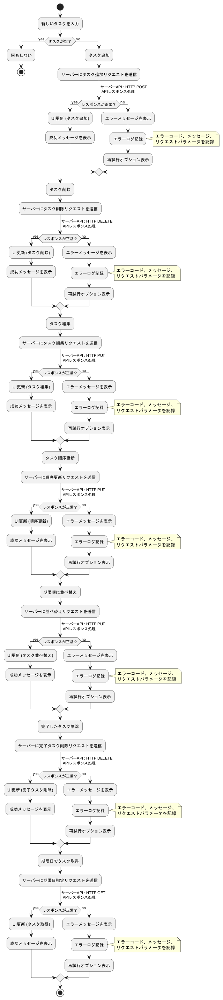

= 使用技術の詳細

== 1. 概要

=== 1.1 イントロダクション

このドキュメントは、Nuxt.js を使用したタスク管理アプリケーションの設計書です。アプリケーションの構成、使用技術、動作フローについて詳細に説明します。

=== 1.2 目的

このドキュメントの目的は、プロジェクトの開発者がアプリケーションの設計と実装について統一された理解を持つことを助けることです。

=== 1.3 範囲

この設計書は、フロントエンドおよびバックエンドの主要なコンポーネント、データモデル、使用技術、開発およびテストの設定を網羅します。

=== 1.4 定義

このセクションでは、このドキュメントで使用される主要な用語と概念を簡潔に記述します。

* **タスク管理**: タスクの作成、編集、削除、完了などの操作を指します。
* **フロントエンド**: ユーザーが直接操作する部分。Vue.js と Nuxt.js を使用。
* **バックエンド**: サーバーサイドのロジックとデータ管理を担当する部分。Flask と MySQL を使用。

== 2. アーキテクチャ

=== 2.1 アーキテクチャ図

アーキテクチャ図はアプリケーション全体の構成を視覚的に示します。各コンポーネント間の関係とデータフローが明確にわかります。
以下にアプリケーションの全体アーキテクチャ図を提供し、各コンポーネントの関係を示します。

image::../images/TaskManagementArchitectureDiagram.png[アーキテクチャ図]
image::../images/SystemArchitectureDiagram.png[システムアーキテクチャ図]

=== 2.2 コンポーネント説明

各コンポーネントの詳細な説明を提供します。

image::../images/TaskComponentDiagram.png[コンポーネント図]

== 3. 状態遷移図と状態説明

=== 3.1 状態遷移図

ユーザーの操作に応じた状態遷移図を提供します。

image::../images/TaskStateTransitionDiagram.png[状態遷移図]

=== 3.2 状態説明

各状態の詳細な説明を提供します。

状態遷移図に基づいて、各状態の詳細を以下に説明します：

1. **初期状態**: アプリケーションが初期化された状態。
2. **ログイン状態**: ユーザーがログインしている状態。
3. **タスク表示状態**: ユーザーがタスクを表示している状態。
4. **タスク編集状態**: ユーザーがタスクを編集している状態。
5. **タスク完了状態**: ユーザーがタスクを完了させた状態。
6. **ログアウト状態**: ユーザーがログアウトしている状態。

== 4. フローチャート

=== 4.1 全体のフローチャート

以下のフローチャートは、アプリケーション全体の主要な操作フローを示しています。ユーザーの操作に基づくシステムの挙動が一目でわかります。
これにより、設計書がさらにわかりやすくなり、他の開発者にも理解しやすくなります。

image::../images/DetailedInteractionDiagram.png[詳細なインタラクション図]
image::../images/SimpleInteractionDiagram.png[シンプルなインタラクション図]
image::../images/TaskManagementDeploymentDiagram.png[タスク管理デプロイメント図]
image::../images/TaskManagementPackageDiagram.png[パッケージ図]
image::../images/TaskManagementUseCaseDiagram.png[ユースケース図]

=== 4.2 フロントエンドフローチャート

フロントエンドの具体的な操作フローを示すフローチャートです。

image::../images/FrontendTaskFlowchart.png[フロントエンドタスクフロー]
image::../images/TaskAddSequenceDiagram.png[タスク追加シーケンス図]
image::../images/TaskClassDiagram.png[タスククラス図]

=== 4.3 詳細なプロセス説明

このセクションでは、各プロセスのステップバイステップの詳細な説明を提供します。

==== 4.3.1 タスクの作成

1. **タスクの作成ボタンをクリック**:
   - ユーザーはタスク一覧画面で「新しいタスクを作成」ボタンをクリックします。

2. **タスク作成フォームの表示**:
   - 新しいタスク作成フォームが表示されます。ユーザーはタスク名、説明、期限などの情報を入力します。

3. **タスクの保存**:
   - フォームの「保存」ボタンをクリックすると、入力された情報がサーバーに送信され、新しいタスクがデータベースに保存されます。

4. **タスク一覧へのリダイレクト**:
   - タスクの保存が成功すると、ユーザーはタスク一覧画面にリダイレクトされ、新しいタスクが一覧に表示されます。

==== 4.3.2 タスクの編集

1. **タスクの選択**:
   - ユーザーは編集したいタスクをタスク一覧から選択します。

2. **タスク編集フォームの表示**:
   - 選択したタスクの編集フォームが表示され、ユーザーはタスク名、説明、期限などの情報を編集します。

3. **編集内容の保存**:
   - フォームの「保存」ボタンをクリックすると、編集された情報がサーバーに送信され、タスクが更新されます。

4. **タスク一覧へのリダイレクト**:
   - タスクの編集が成功すると、ユーザーはタスク一覧画面にリダイレクトされ、更新されたタスクが一覧に表示されます。

==== 4.3.3 タスクの削除

1. **タスクの選択**:
   - ユーザーは削除したいタスクをタスク一覧から選択します。

2. **削除確認ダイアログの表示**:
   - タスク削除確認ダイアログが表示され、ユーザーは削除の意図を確認します。

3. **タスクの削除**:
   - ユーザーが「削除」ボタンをクリックすると、タスクがサーバーから削除され、データベースからも削除されます。

4. **タスク一覧の更新**:
   - タスクの削除が成功すると、タスク一覧が更新され、削除されたタスクが一覧から消えます。

== 5. データモデル

=== 5.1 データベース構造

データベースの構造を説明します。このアプリケーションのデータベースは以下のように定義されています：

[source, database, subs="verbatim"]
----
include::../sample/backend/sql/initialize_db.sql[データベース初期化SQ]
----

このデータベース構造により、タスク管理アプリケーションで使用されるタスクデータが格納されます。各タスクには以下の項目が含まれます：

* `id`: 一意の識別子（自動増分、主キー）
* `text`: タスクの内容
* `completed`: タスクの完了状態（デフォルトは FALSE）
* `dueDate`: タスクの期限日

=== 5.2 ER 図

エンティティとリレーションの図を示します。

image::../images/TaskDatabaseERDiagram.png[ER図]

== 6. サンプルコード

=== 6.1 フロントエンドコード

フロントエンドの主要なコード例を提供します。

[source, vue, subs="verbatim"]
----
include::../sample/frontend/src/components/TaskList.vue[タスク一覧コンポーネント]
----

==== 6.1.1 フロントエンドデザイン

このセクションでは、フロントエンドのデザイン例を示します。これらのデザインは、開発者が実際のフロントエンドを実装する際の参考として使用してください。

==== タスク詳細画面

image::../sample/frontend/images/task_detail.png[TaskDetail]

==== タスク編集画面

image::../sample/frontend/images/task_edit.png[TaskEdit]

==== タスクフィルター画面

image::../sample/frontend/images/task_filter.png[TaskFilter]

==== タスク一覧画面

image::../sample/frontend/images/task_list.png[TaskList]

=== 6.2 バックエンドコード

サーバサイドのサンプルコードを提供します。

[source, python, subs="verbatim"]
----
include::../sample/backend/app.py[]
----

== 7. 使用技術の詳細

=== 7.1 フロントエンド技術

1. **Vue.js**
   - **説明**: Vue.js は、インタラクティブなユーザーインターフェースを構築するための JavaScript フレームワークです。
   - **特徴**: コンポーネントベースのアーキテクチャ、双方向データバインディング、仮想 DOM など。
   - **バージョン**: `latest`

2. **Nuxt3**
   - **説明**: Nuxt.js は、Vue.js の拡張フレームワークで、サーバーサイドレンダリング（SSR）や静的サイト生成（SSG）をサポートします。
   - **特徴**: ルーティングやデータフェッチの簡略化、豊富なモジュールエコシステム。
   - **バージョン**: `^3.15.1`

3. **Vue Toastification**
   - **説明**: ユーザーに非侵入的な通知を提供するためのライブラリ。
   - **特徴**: シンプルでカスタマイズ可能なトースト通知。
   - **バージョン**: `^2.1.2`

=== 7.2 バックエンド技術

1. **Flask**
   - **説明**: Flask は、Python の軽量な Web フレームワークです。RESTful API を迅速に構築できます。
   - **特徴**: 軽量、柔軟、豊富な拡張機能を持つ。
   - **バージョン**: `^2.2.2`

2. **MySQL**
   - **説明**: MySQL は、リレーショナルデータベース管理システムです。
   - **特徴**: 高性能、大規模なデータを扱う能力、広範なサポート。
   - **バージョン**: `^8.0.26`

== 8. テスト

=== 8.1 ユニットテスト

ユニットテストを使用して、システム全体の各機能が期待通りに動作することを確認します。

以下は、主要なユニットテストの例です：

==== 8.1.1 タスク作成のテスト

タスク作成機能が正常に動作するかどうかを確認します。

[source, python]
----
import unittest
from app import create_task

class TestTaskCreation(unittest.TestCase):
    def test_create_task(self):
        task_data = {
            "text": "Test Task",
            "dueDate": "2025-02-01"
        }
        response = create_task(task_data)
        self.assertEqual(response.status_code, 201)
        self.assertIn("Task created successfully", response.json()['message'])
----
==== 8.1.2 タスク削除のテスト

タスク削除機能が正しく動作するかをテストします。

[source, python]
----
import unittest
from app import delete_task

class TestTaskDeletion(unittest.TestCase):
    def test_delete_task(self):
        task_id = 1  # テスト用タスクID
        response = delete_task(task_id)
        self.assertEqual(response.status_code, 200)
        self.assertIn("Task deleted successfully", response.json()['message'])
----
=== 8.2 統合テスト

統合テストでは、システム全体のフローが期待通りに動作するかを確認します。

==== 8.2.1 タスク作成から表示までのフロー

ユーザーがタスクを作成し、そのタスクがタスク一覧に表示されることを確認します。

[source, python]
----
import unittest
from app import create_task, get_tasks

class TestTaskCreationAndDisplay(unittest.TestCase):
    def test_task_creation_and_display(self):
        task_data = {
            "text": "Test Task",
            "dueDate": "2025-02-01"
        }
        create_response = create_task(task_data)
        self.assertEqual(create_response.status_code, 201)
        
        get_response = get_tasks()
        self.assertIn("Test Task", [task['text'] for task in get_response.json()['tasks']])
----
==== 8.2.2 タスク編集と更新のフロー

タスクを編集し、その変更が正しく反映されることを確認します。

[source, python]
----
import unittest
from app import edit_task, get_task_by_id

class TestTaskEditAndUpdate(unittest.TestCase):
    def test_task_edit_and_update(self):
        task_id = 1  # テスト用タスクID
        updated_data = {
            "text": "Updated Task Text",
            "dueDate": "2025-02-05"
        }
        edit_response = edit_task(task_id, updated_data)
        self.assertEqual(edit_response.status_code, 200)
        
        task_response = get_task_by_id(task_id)
        self.assertEqual(task_response.json()['text'], "Updated Task Text")
----
=== 8.3 E2E テスト

End-to-End テストでは、実際のユーザーの操作をシミュレートし、システム全体の挙動を確認します。

==== 8.3.1 ログインからタスク管理までのフロー

ユーザーがログインし、その後タスクを作成、表示、編集、削除する一連の流れをテストします。

[source, python]
----
import unittest
from app import login, create_task, get_tasks, edit_task, delete_task

class TestUserTaskManagement(unittest.TestCase):
    def test_user_task_management(self):
        # ユーザーがログイン
        login_response = login(username="testuser", password="password123")
        self.assertEqual(login_response.status_code, 200)
        
        # タスク作成
        task_data = {
            "text": "New Task",
            "dueDate": "2025-02-01"
        }
        create_response = create_task(task_data)
        self.assertEqual(create_response.status_code, 201)
        
        # タスク表示
        tasks = get_tasks()
        self.assertIn("New Task", [task['text'] for task in tasks.json()['tasks']])
        
        # タスク編集
        updated_data = {
            "text": "Updated Task",
            "dueDate": "2025-02-05"
        }
        edit_response = edit_task(1, updated_data)  # タスクID 1
        self.assertEqual(edit_response.status_code, 200)
        
        # タスク削除
        delete_response = delete_task(1)
        self.assertEqual(delete_response.status_code, 200)
----
== 9. デプロイ

=== 9.1 デプロイメント手順

このセクションでは、アプリケーションをデプロイするための手順を説明します。

==== 9.1.1 フロントエンドのデプロイ

1. **環境の準備**: 必要な依存関係をインストールします。
   [source,bash]
   ----
   npm install
   ----

2. **ビルドの実行**: アプリケーションをビルドします。
   [source,bash]
   ----
   npm run build
   ----

3. **サーバーの起動**: 開発用サーバーを起動します。
   [source,bash]
   ----
   npm run start
   ----

4. **本番環境へのデプロイ**: 本番環境にデプロイするためのコマンドを実行します。
   [source,bash]
   ----
   npm run generate
   ----

5. **デプロイメントサービス**: 本番環境には、Vercel や Netlify を使用することを推奨します。

==== 9.1.2 バックエンドのデプロイ

1. **環境の準備**: 必要な依存関係をインストールします。
   [source,bash]
   ----
   pip install -r requirements.txt
   ----

2. **サーバーの起動**: アプリケーションを起動します。
   [source,bash]
   ----
   flask run
   ----

3. **本番環境へのデプロイ**: Heroku や AWS を使用して本番環境にデプロイできます。

=== 9.2 デプロイ後の確認事項

デプロイが完了した後に行うべき確認事項をリストアップします。

1. **API エンドポイントの確認**: 正しくエンドポイントが機能しているかをテストします。
2. **フロントエンドの表示確認**: UI が正しく表示されているかを確認します。
3. **データベース接続の確認**: バックエンドがデータベースと正常に接続されているかを確認します。

== 10. 結論

このドキュメントでは、タスク管理アプリケーションの設計、使用技術、動作フロー、テスト手法、デプロイメントの手順について詳細に説明しました。本アプリケーションは、ユーザーにとって直感的に使いやすいインターフェースと、効率的なタスク管理機能を提供します。今後の改善点としては、UI のさらなる改善や、新しい機能の追加が考えられます。

